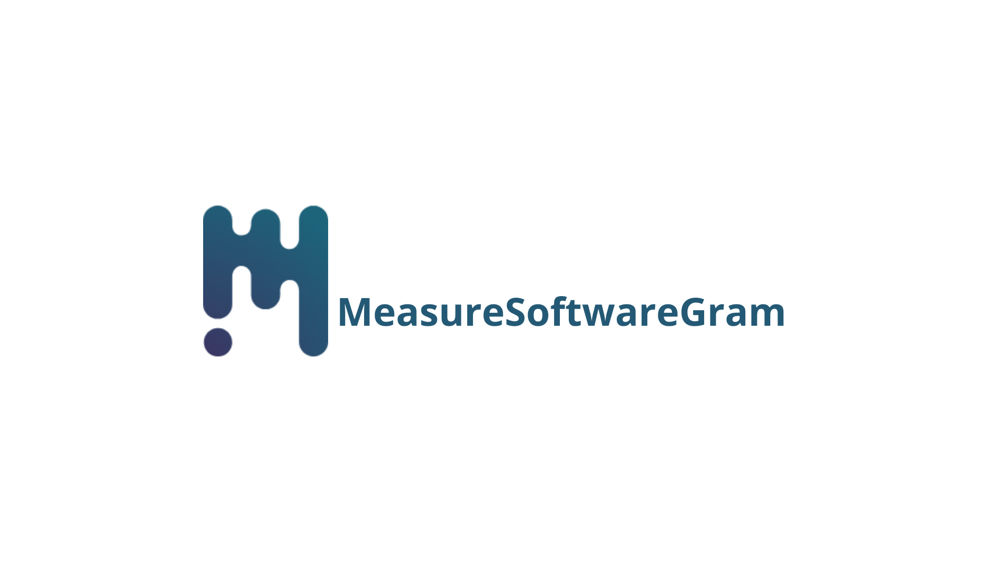
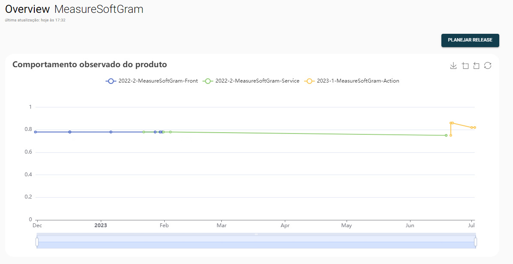

# Ação do GitHub para Análise de Código com MeasureSoftGram

Use essa Ação do GitHub para realizar uma análise de código com o [MeasureSoftGram](https://github.com/fga-eps-mds/2023-1-MeasureSoftGram-Service). A ferramenta gera resultados de análise de código, que são enviador ao servidor web e mostrado em formas de graficos quando seus pull requests para a main (ou branch escolhida) sejam fechados.



O MeasureSoftGram é uma ferramenta robusta para gestão e avaliação de qualidade de software. Ele suporta múltiplos atributos de qualidade e retorna métricas analisadas de software com base em modelos algébricos. O MeasureSoftGram é completamente gratuito para projetos open-source.

## Pré-requisitos

* Ter uma conta no GitHub. [Crie uma gratuitamente agora](https://github.com/signup) caso ainda não possua!
* O repositório para análise está configurado no MeasureSoftGram.
* Ter uma release em andamento criado no [web](https://2023-1-measure-soft-gram-front.vercel.app/)
* Ter um token de acesso ao MeasureSoftGram. [Crie um gratuitamente agora](https://2023-1-measure-soft-gram-front.vercel.app/) caso ainda não possua!

## Uso
Para utilizar o MeasureSoftGram no seu repositório GitHub, crie um novo fluxo de trabalho do GitHub Actions (por exemplo, `msgram-analysis.yml`) no diretório `.github/workflows`. No novo arquivo, insira o seguinte código:

```yaml
on:
  pull_request:
    branches: [ main ]
    types: [ closed ]
jobs:
  msgram_job:
    runs-on: ubuntu-latest
    steps:
      - name: Checkout
        uses: actions/checkout@v3
      - name: Rodar a action do MeasureSoftGram
        uses: ./ # Usa uma ação no diretório raiz
        id: msgram
        with:
          githubToken: ${{ secrets.GITHUB_TOKEN }} # Token do GitHub
          sonarProjectKey: "" # (opcional) Chave do projeto no SonarQube
          msgramServiceToken: ${{ secrets.MSGRAM_SERVICE_TOKEN }} # Token para acessar o serviço MeasureSoftGram
          productName: "" # Nome do produto
```

## Entradas

| entrada | obrigatório | descrição |
| ------- | ----------- | --------- |
| `githubToken` | sim | Token do GitHub. Mais informações em [Token do GitHub](https://docs.github.com/en/actions/reference/authentication-in-a-workflow#about-the-github_token-secret) |
| `sonarProjectKey` | não | Chave do projeto no SonarQube. A chave padrão é coletada a partir das informações coletadas do repositorio no github '<proprietário do repositorio>_<nome do repositório>'. |
| `msgramServiceToken` | sim | Token para acessar o serviço MeasureSoftGram |
| `productName` | sim | Nome do produto |

Lembre-se que é necessário que você disponha do seu token do GitHub para executar o MeasureSoftGram. Recomendamos o uso dos [Segredos do GitHub](https://docs.github.com/pt/actions/security-guides/encrypted-secrets#creating-encrypted-secrets-for-a-repository) para armazenar estas credenciais de forma segura.


## Resultados da análise no pull request

Os resultados são adicionados ao website do MeasureSoftwareGram e exibidos nesse gráfico:



## Roadmap

Estamos sempre trabalhando para melhorar e expandir as capacidades do MeasureSoftGram. Aqui estão algumas atualizações planejadas:

- [x] **Persistência dos resultados:** Em futuras atualizações, planejamos permitir o armazenamento dos resultados gerados pelo calculo da action na nossa aplicação web.
- [ ] **Configurações personalizáveis via web:** Planejamos permitir que o usuário altere as configurações a partir do input da ação, puxando do serviço web.
- [ ] **Expansão da integração do Parser:** O [Parser](https://github.com/fga-eps-mds/2023-1-MeasureSoftGram-Parser) irá expandir sua integração com ferramentas de análise para além do SonarQube.
- [ ] **Badges no README:** Planejamos adicionar uma funcionalidade que permitirá aos usuários exibir badges com métricas no README do seu repositório. Com isso, você poderá fornecer uma visão rápida da qualidade do software diretamente no seu README.