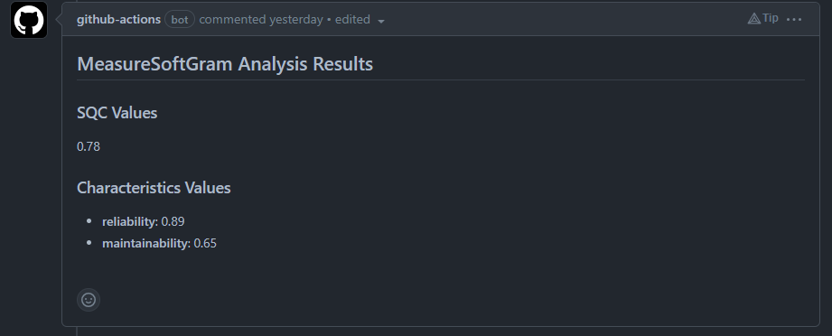

# 2023-1-MeasureSoftGram-Action

Esta é uma ação do Github que executa o [Msgram-CLI](https://github.com/fga-eps-mds/2023-1-MeasureSoftGram-CLI), baseando-se nos resultados dos testes de ferramentas de analise de codigo como o Sonarqube, e adiciona os resultados como anotações em seus pull requests. 

**Nota:** Esta ação é destinada a ser executada quando um pull request é feito para as branches main ou develop.

## Sobre o Msgram
O Msgram é um robusto sistema de gerenciamento e avaliação de qualidade de software. Ele atua como uma ferramenta de apoio ao planejamento e comparação das qualidades nas releases, fornecendo uma análise abrangente da qualidade do produto e do processo. Ele retorna valores das métricas analisadas de software e avalia a qualidade a partir de modelos algébricos, analisando múltiplos atributos de qualidade. O Msgram é um projeto de software livre, com foco em prover uma ferramenta acessível e eficiente para a gestão da qualidade do software.

## Exemplo de Saída



## Uso
Para utilizar o MeasureSoftGram no seu repositório GitHub, crie um novo fluxo de trabalho do GitHub Actions (por exemplo, `msgram-analysis.yml`) no diretório `.github/workflows`. No novo arquivo, insira o seguinte código:

```yaml
on:
  pull_request:
    branches: [ main ]

jobs:
  msgram_analysis:
    runs-on: ubuntu-latest
    name: Análise MeasureSoftGram
    steps:
      - name: Checkout
        uses: actions/checkout@v3
      - name: MeasureSoftGram action step
        uses: ./ # Usa uma ação no diretório raiz
        id: msgram
        with:
          host: "" # (opcional) SonarQube Server URL
          token: "" # (opcional) SonarQube token
          githubToken: ${{ secrets.GITHUB_TOKEN }} # GitHub token
          projectKey: "" # (opcional) SonarQube project key
          msgramConfigPath: "./.github/input/msgram.json" # (opcional) Configuração do MeasureSoftGram
```

Os valores padrões para o msgram.json podem ser encontrados na nossa documentação [link](https://fga-eps-mds.github.io/2023-1-MeasureSoftGram-Doc/manual-de-uso/cli/).


## Entradas

| entrada | obrigatório | descrição |
| ------- | ----------- | --------- |
| `host` | não | URL do servidor SonarQube. A url padrão é 'https://sonarcloud.io'. |
| `token` | não | Token do SonarQube. Talvez isso seja necessário caso o repositorio seja privado. |
| `projectKey` | não | Chave do projeto no SonarQube. A chave padrão é coletada a partir das informações coletadas do repositorio no github '<proprietário do repositorio>-<nome do repositório>'. |
| `githubToken` | sim | Token do GitHub. Mais informações em [Token do GitHub](https://docs.github.com/en/actions/reference/authentication-in-a-workflow#about-the-github_token-secret) |
| `msgramConfigPath` | não | Caminho para o arquivo de configuração do MeasureSoftGram. Caso não seja passado um caminho, os valores padrões serão utilizados. |

Lembre-se que é necessário que você disponha do seu token do GitHub para executar o MeasureSoftGram. Recomendamos o uso dos [Segredos do GitHub](https://docs.github.com/pt/actions/security-guides/encrypted-secrets#creating-encrypted-secrets-for-a-repository) para armazenar estas credenciais de forma segura.


## Roadmap

Estamos sempre trabalhando para melhorar e expandir as capacidades do Msgram. Aqui estão algumas atualizações planejadas:

- [ ] **Persistência dos resultados:** Em futuras atualizações, planejamos permitir o armazenamento dos resultados gerados pelo calculo da action na nossa aplicação web.
- [ ] **Configurações personalizáveis via web:** Planejamos permitir que o usuário altere as configurações a partir do input da ação, puxando do serviço web.
- [ ] **Expansão da integração do Parser:** O [Parser](https://github.com/fga-eps-mds/2023-1-MeasureSoftGram-Parser) irá expandir sua integração com ferramentas de análise para além do SonarQube.
- [ ] **Badges no README:** Planejamos adicionar uma funcionalidade que permitirá aos usuários exibir badges com métricas no README do seu repositório. Com isso, você poderá fornecer uma visão rápida da qualidade do software diretamente no seu README.

